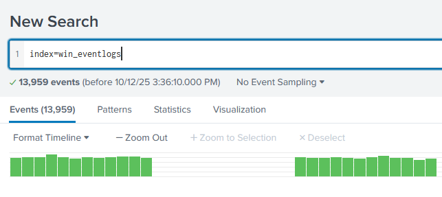
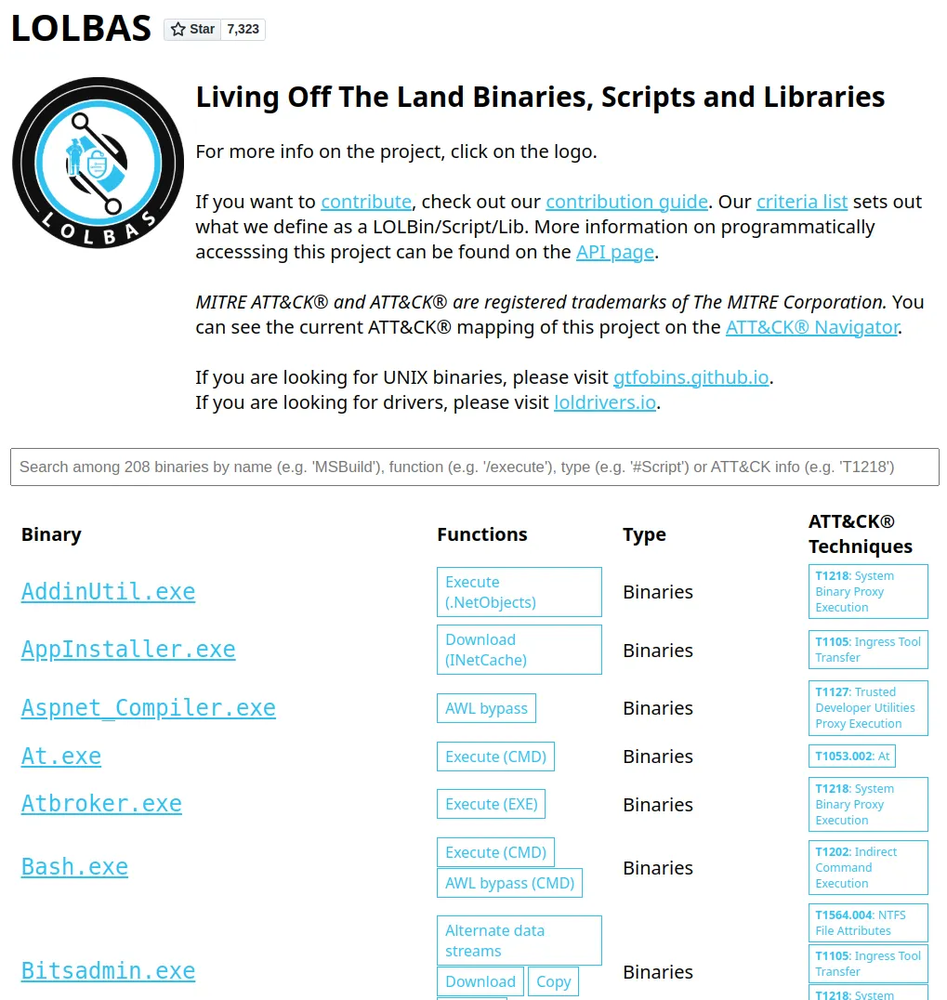
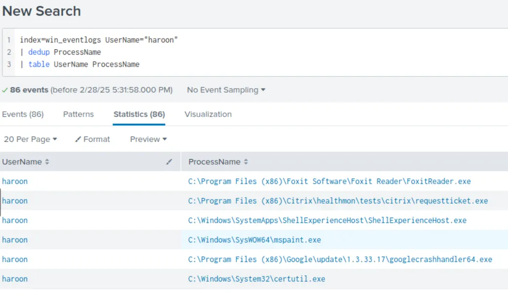
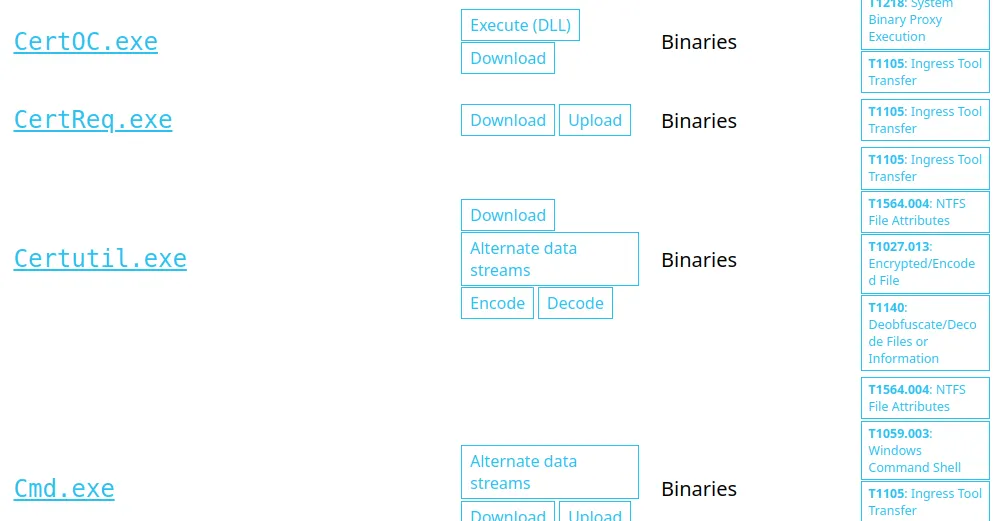
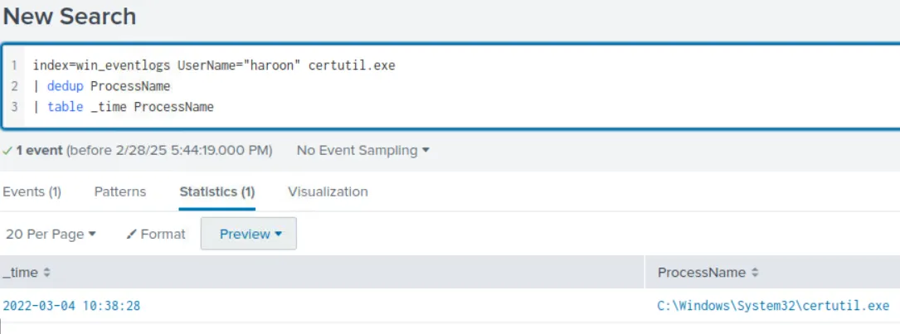
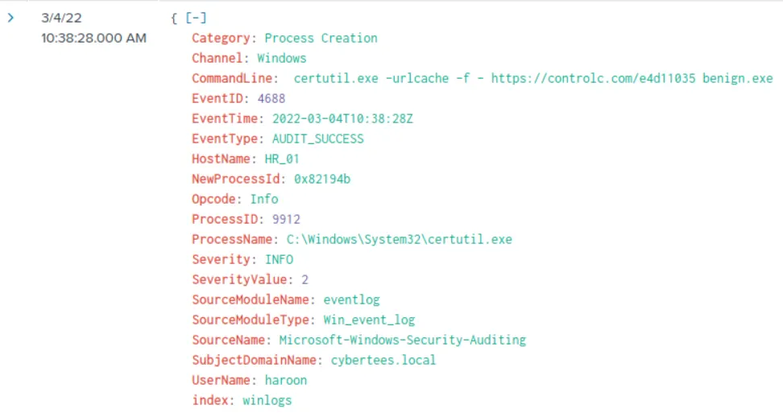
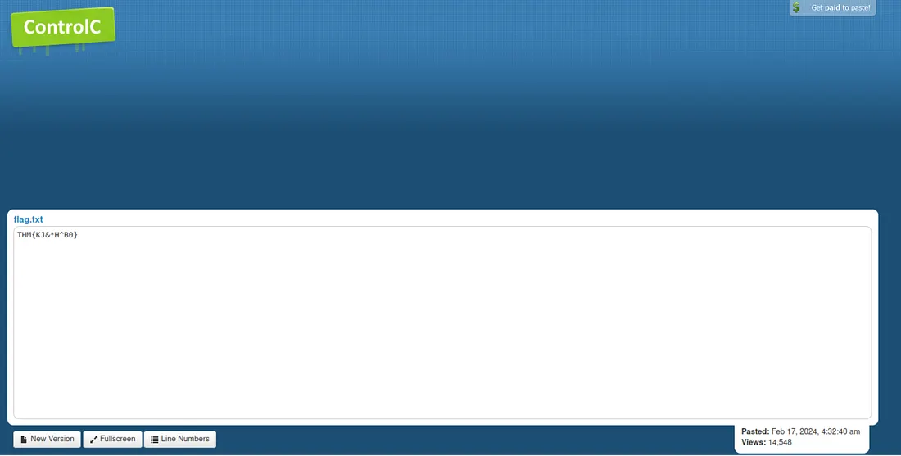

# #39: Splunk: Investigate a compromised host ⚔️

**Goal:** Investigate a suspected compromise on an HR host using Splunk. I’ll hunt for anomalous activity, identify persistence/download techniques, and extract forensic artifacts (binary executed, download source, saved filename, and the embedded flag).

---

## Scenario Overview & Preparation

An IDS flagged unusual process executions on a host in the HR department. Attackers often use legitimate system utilities (LOLBINs) to download or execute payloads to evade detection. My objective is to use Splunk queries over `index=win_eventlogs` for March 2022 to discover which HR host was abused and how.

**Environment:**

I deployed the lab VM and opened Splunk Search & Reporting. All relevant logs are in `index=win_eventlogs`. I set Splunk to verbose / ALL time where needed and restricted time windows to March 2022 when required.



---

## Step 1 — Confirm March 2022 log volume

Verify sufficient telemetry exists for the investigation timeframe.

I set the **Date Range** to the month of March and view the results.


**Observation / Result:**


Total logs ingested for March 2022: **13,959**.

**Answer:** `13959`

---

## Step 2 — Find the imposter account

Attackers create accounts similar to real users (typo-squatting) to persist without raising immediate suspicion. Listing unique usernames helps spot small variations.

Example Query:

```
index=win_eventlogs | stats count by UserName | sort - count
```


or

To create a table of UserName field with **dedup** function to remove any duplicate values.

```
index=win_eventlogs 
| dedup UserName 
| table UserName
```

**Observation:**


I enumerated usernames and noticed an imposter account that mimics an HR user (`Amelia`) by substituting a character.

**Answer (imposter username):** `Amel1a`

---

## Step 3 — Determine which HR user ran scheduled tasks

Scheduled tasks are a common persistence mechanism (T1053). Identifying users invoking `schtasks.exe` isolates candidates for compromise.

`schtasks.exe`is a legitimate Windows system file that manages scheduled tasks on a computer. It allows users to create, modify, delete, and query scheduled tasks through a command-line interface.


**Observation:**

Four users executed scheduled tasks; among them `Chris.fort` belongs to HR.

**Answer (HR user running scheduled tasks):** `Chris.fort`

---

## Step 4 — Identify which HR user used a LOLBIN to download a payload

Living-Off-The-Land Binaries (LOLBINs) like `certutil.exe` are legitimate Windows tools frequently abused to fetch and decode payloads. I checked HR users’ process histories against known LOLBINs.

For this, I clicked the link below to check out the URL provided in the Hint to find the binaries used to download the payload.

http://lolbas-project.github.io/



Now I need to manually check the processes run by each user from the HR Department against these binaries listed in the URL.



Eventually, I see the user named **haroon** run the **`certutil.exe`** process that is present in the list.



**Observation:**

The HR user `haroon` executed `certutil.exe`, matching a known LOLBIN used to download files.

**Answer (user):** `haroon`

**Answer (LOLBIN used):** `certutil.exe`

---

## Step 5 — Find when the LOLBIN was executed

Timestamping execution is important for timeline and IOC correlation.

**Query I ran:**

```
index=win_eventlogs UserName="haroon" certutil.exe
| dedup ProcessName 
| table _time ProcessName
```

**Observation / Result:**



The execution date recorded: **2022-03-04**.

**Answer (date executed):** `2022-03-04`

---

## Step 6 — Determine which third-party site was used to download the payload

Identifying remote hosts or file-sharing services reveals the attacker’s delivery channel and potential C2 or exfiltration endpoints.

Checking the event log for **`certutil.exe`** process, I found the command used to execute this process.




**Observation:**

The `CommandLine` for `certutil.exe` included a URL pointing to a third-party paste/file-hosting site: `controlc.com`.

**Answer (third-party site):** `controlc.com`

---

## Step 7 — Identify the filename saved on the host

Knowing the filename allows artifact collection and static/dynamic analysis.

**What I inspected:**

From the `certutil` command-line event I checked the `-out` / file path argument captured by Windows logging.


The downloaded/saved filename on the host was **`benign.exe`**.

**Answer:** `benign.exe`

---

## Step 8 — Extract the embedded flag from the file or posted content

The file contained a recognizable pattern `THM{...}`; retrieving it validates the payload contents and completes the forensic objective.

**Method:**



I visited the posted URL from the certutil command. The site content revealed the flag.

**Answer (embedded pattern):** `THM{KJ&*H^B0}`

---

## Step 9 — Provide the exact URL contacted by the infected host

The full URL is an actionable IOC to block, investigate further, or request takedown.

The infected host connected to:

**`https://controlc.com/e4d11035`**

---

## Final Summary

- I validated log coverage (13,959 events for March 2022) in `index=win_eventlogs`.
- I searched usernames and found an imposter account `Amel1a` (typo-squatting `Amelia`).
- I inspected scheduled-task activity and confirmed `Chris.fort` (HR) invoked scheduled tasks.
- I enumerated HR users’ processes against known LOLBINs and discovered `haroon` executed `certutil.exe`, a common LOLBIN for downloading files.
- I retrieved the exact `certutil.exe` command and observed it downloaded `benign.exe` from `controlc.com`. The execution date was **2022-03-04**.
- I followed the URL `https://controlc.com/e4d11035` and recovered the embedded flag `THM{KJ&*H^B0}`.

**Key findings & next steps I recommend:**

1. **Containment:** Isolate host(s) where `certutil.exe` and `benign.exe` were observed (haroon’s machine).
2. **Forensics:** Acquire `benign.exe` sample and memory image for dynamic/static analysis; collect registry and scheduled task artifacts.
3. **Hunting / Detection:** Create Splunk detection rules for `certutil.exe` command-lines downloading from controlc.com or similar paste hosts, and for account creation events that mimic legitimate usernames (typo-squatting).
4. **Blocking / Remediation:** Block `controlc.com/e4d11035` at network perimeter and add the MD5/sha256 of `benign.exe` to AV/EDR blocklists.
5. **Review:** Audit scheduled tasks and newly created user accounts (e.g., `Amel1a`), and validate legitimate user credentials and restore if required.
