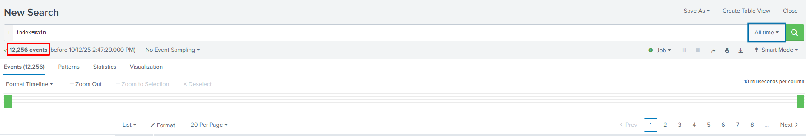
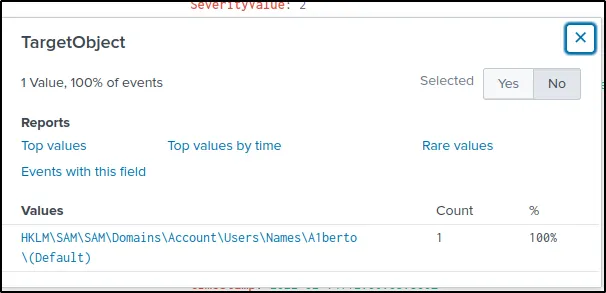
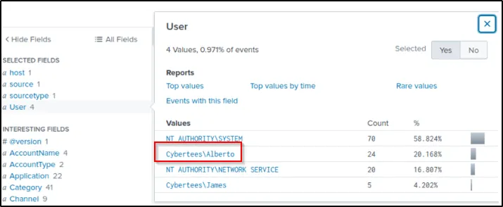
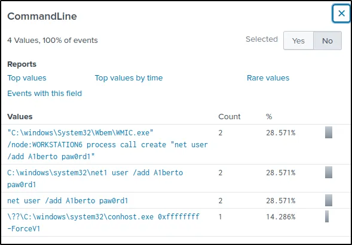
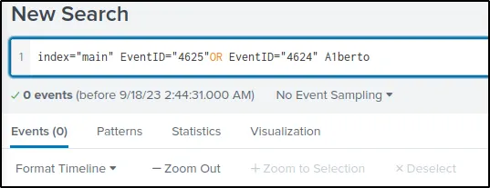
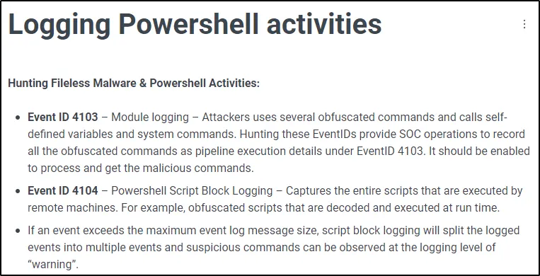
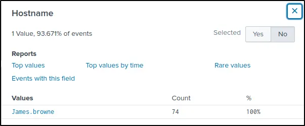
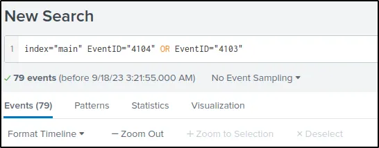
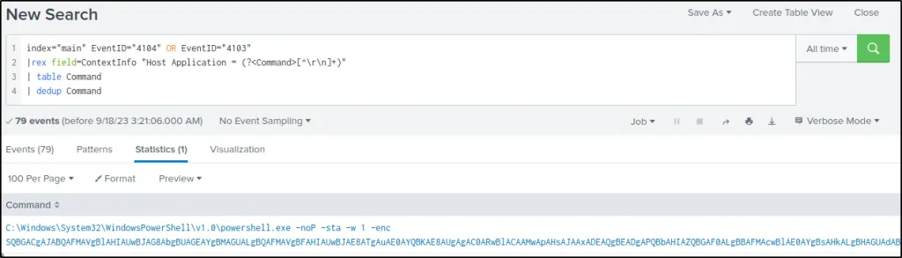
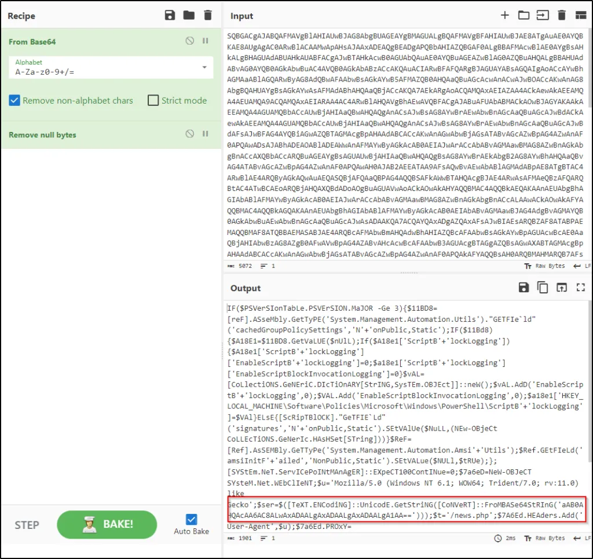

# #38: Splunk: Investigate anomalies ⚔️

**Goal:** Examine ingested Windows logs in `index="main"` to find anomalies, identify a backdoor user, and trace associated activity (registry changes, remote creation, PowerShell execution, and network callbacks).

---

## Step 0 — Confirm data ingestion

**Why:** Verify logs are available before starting investigation.

**Query I ran:**

```
index="main"
```

**Observation / Answer:**



I confirmed **12,256** events were collected and ingested in the `main` index.

**Answer:** `12256`

---

## Step 1 — Find new user account creation

**Why:** User account creation on endpoints is a strong indicator of persistence/backdoor activity.

**Query I ran:**

```
index="main" EventID="4720"
```

**Observation:**


Event ID 4720 (user account created) returned a user creation event.

**Answer (new username):** `A1berto`

---

## Step 2 — Locate registry change for the backdoor account

**Why:** Malware/backdoors often add registry entries; mapping the key gives persistence context.

**Query I ran:**

```
index="main" EventID=13 A1berto
```

**Observation:**


I clicked the `TargetObject` field for the EventID=13 result and found the registry path that was updated for the new user.



**Answer (full registry path):** `HKLM\SAM\SAM\Domains\Account\Users\Names\A1berto`

---

## Step 3 — Determine impersonation target

**Why:** Attackers often create usernames similar to legitimate users to evade detection.

**Query I ran:**

```
index="main"
```

**Observation:**

I examined the `User` field values and noted the created account `A1berto` is not the same as `Alberto` — the adversary attempted to impersonate `Alberto`.



**Answer (impersonated user):** `Alberto`

---

## Step 4 — Identify the remote command used to add the backdoor user

**Why:** Understanding the exact command shows the attacker’s remote execution vector.

**Query I ran (filtered 4688/1 events and inspected CommandLine):**

Filter events with ID of 4688 of Sysmon event ID of 1. (Both are process creation ID)

```
index="main" EventID=1 OR EventID=4688 A1berto
```

**Observation:**

From the `CommandLine` field I found a WMIC remote execution command that created the new user.



**Answer (command used):**

`C:\windows\System32\Wbem\WMIC.exe” /node:WORKSTATION6 process call create “net user /add A1berto paw0rd1`

---

## Step 5 — Check for backdoor user login attempts

**Why:** If the backdoor was used interactively, there should be successful/failed logons (4624/4625).

**Query I ran:**

```
index="main" EventID="4625" OR EventID="4624" A1berto
```

**EventID** = 4624 (Account successfully logged in)

**EventID** = 4625 (Account failed to log in)

**Observation / Answer:**



No login attempts by the backdoor user were observed during the investigation.

**Answer:** `0`

---

## Step 6 — Identify host with suspicious PowerShell activity

**Why:** Malicious PowerShell execution often indicates post-exploitation behavior and callbacks.

**Query I ran:**

The following query filters Powershell events.

```
index="main" EventID="4104" OR EventID="4103"
```



**Observation:**

PowerShell logging (EventID 4104/4103) returned events from a single host.



**Answer (infected host):** `James.browne`

---

## Step 7 — Count PowerShell events for the malicious execution

**Why:** Volume of PowerShell events helps scope the activity.

**Query I ran:** (same PowerShell query as above)

```
index="main" EventID="4104" OR EventID="4103”
```

**Observation / Answer:**



I observed **79** PowerShell events related to the malicious execution.

**Answer:** `79`

---

## Step 8 — Extract encoded PowerShell payload and find the callback URL

**Why:** Encoded PowerShell often contains network I/O (web requests) — extracting it can reveal C2 or payload hosts.

**Query I ran to extract the host application value (deduplicated):**

```
index="main" EventID="4104" OR EventID="4103"
| rex field=ContextInfo "Host Application = (?<Command>[^\r\n]+)"
| table Command
| dedup Command
```

This modified query will extract the value of “Host Application” from the field “ContextInfo”, present it on a table without duplicate command

**Observation:**

The `Command` value was base64-encoded. 



I copied the encoded value, decoded it externally (CyberChef), and found a web request to a PHP resource.



**Answer (full URL observed):** `hxxp[://]10[.]10[.]10[.]5/news[.]php`

---

## Concise Summary

- I validated `12,256` events in `index="main"`.
- I located a newly created user `A1berto` (EventID 4720) and the registry key `HKLM\SAM\SAM\Domains\Account\Users\Names\A1berto`.
- The adversary was impersonating `Alberto`.
- The backdoor user was created remotely using WMIC:
    
    `C:\windows\System32\Wbem\WMIC.exe” /node:WORKSTATION6 process call create “net user /add A1berto paw0rd1`
    
- There were **0** observed login attempts by `A1berto`.
- I found malicious PowerShell activity on host `James.browne` with **79** related events.
- Decoding the encoded PowerShell revealed a web callback to: `hxxp[://]10[.]10[.]10[.]5/news[.]php`.