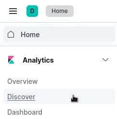
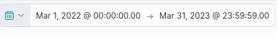
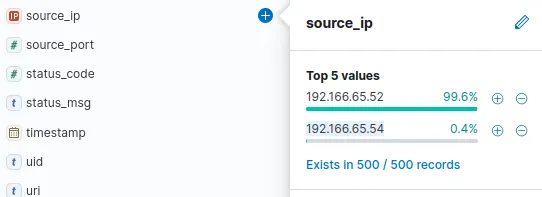
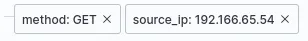
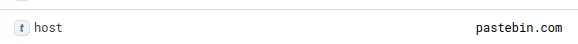
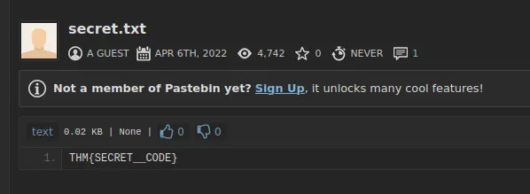

# #35: ItsyBitsy (ELK): Investigate an incident ⚔️

# Kibana C2 Investigation

## Scenario Overview

During normal SOC monitoring, analyst **John** observed a suspicious alert in the IDS indicating possible **Command and Control (C2)** communication from a user named **Browne** (HR department).

The suspicious file contained a malicious pattern **THM:{ ________ }**.

A week’s worth of **HTTP connection logs** were pulled and ingested into the **connection_logs** index in **Kibana** for analysis.

My objective was to investigate Browne’s activity, identify the C2 connection, and extract the hidden flag from the malicious file.

---

## Step-by-Step Investigation

### **Step 1: Checking Total Events (March 2022)**

1. Opened **Kibana → Discover**.
    
    
    
2. Adjusted the **date filter** (top-right) to cover **March 2022**.
    
    
    
3. Clicked **Update** to refresh results.
    
    
    

---

### **Step 2: Finding Browne’s Source IP**

1. In the **Discover** panel, expanded the left sidebar fields.
2. Clicked on **source_ip** to list all IP addresses.
    
    
    
3. Compared the hit counts for each and identified Browne’s activity source.

**✅ Answer:** `192.166.65.54`

---

### **Step 3: Identifying the Binary Used for Download**

1. Filtered logs by **method: GET** and the **suspect’s IP**.
    
    
    
2. Found only one related event.
3. Inspected the **user_agent** field — it showed **bitsadmin**, a legitimate Windows binary used for background file transfers.

**✅ Answer:** `bitsadmin`

---

### **Step 4: Finding the C2 Communication Site**

1. Reviewed the same filtered result from the previous step.
2. Observed that the destination domain was a well-known file-sharing site — **Pastebin**, often abused by attackers for C2 communication.
    
    
    

---

### **Step 5: Determining the Full C2 URL**

1. In the same log, located the **URI** path accessed by the infected host.
    
    
    
2. Combined the **domain + URI** to form the complete C2 URL.

**✅ Answer:** `pastebin.com/yTg0Ah6a`

---

### **Step 6: Finding the File Accessed**

1. Opened the full C2 link in a browser.
2. Observed the file hosted on Pastebin.
    
    
    
3. Found the name of the file which was accessed on the file sharing site.

---

### **Step 7: Extracting the Hidden Code**

1. Viewed the **content** of `secret.txt` directly on Pastebin.
2. Found the hidden malicious string in the format `THM{_____}`.

---

## 🎯 Conclusion

Through this simple Kibana-based investigation, I successfully traced the infection source, confirmed the use of **legitimate Windows tools** (bitsadmin) for malicious activity, identified the **C2 infrastructure**, and retrieved the **hidden flag** from the accessed file.

This exercise strengthened my understanding of:

- Using **KQL** and Kibana filters for log analysis,
- Recognizing **living-off-the-land** binaries (like bitsadmin),
- Tracing **C2 communications** through HTTP logs.