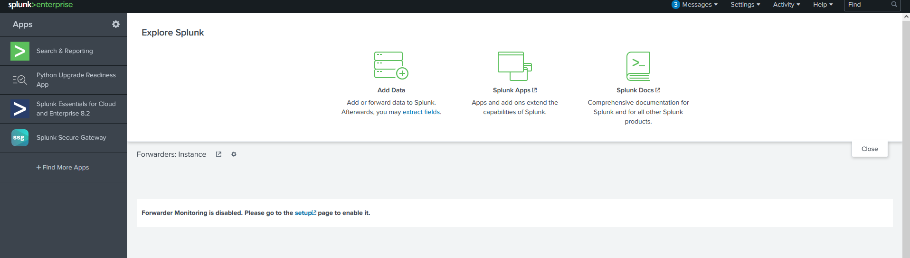
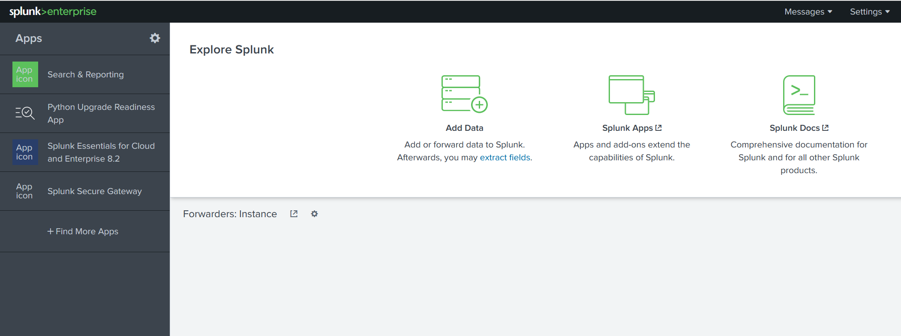
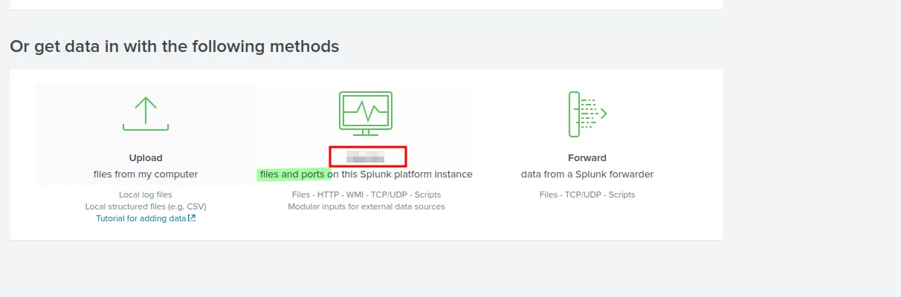
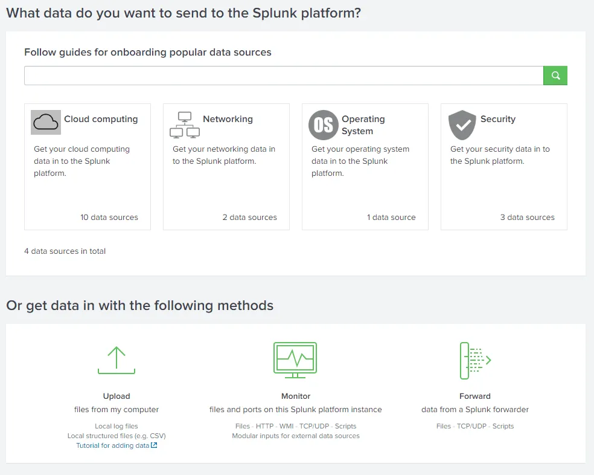
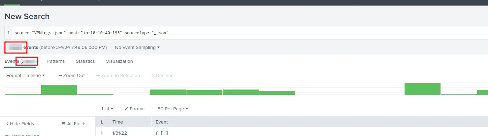
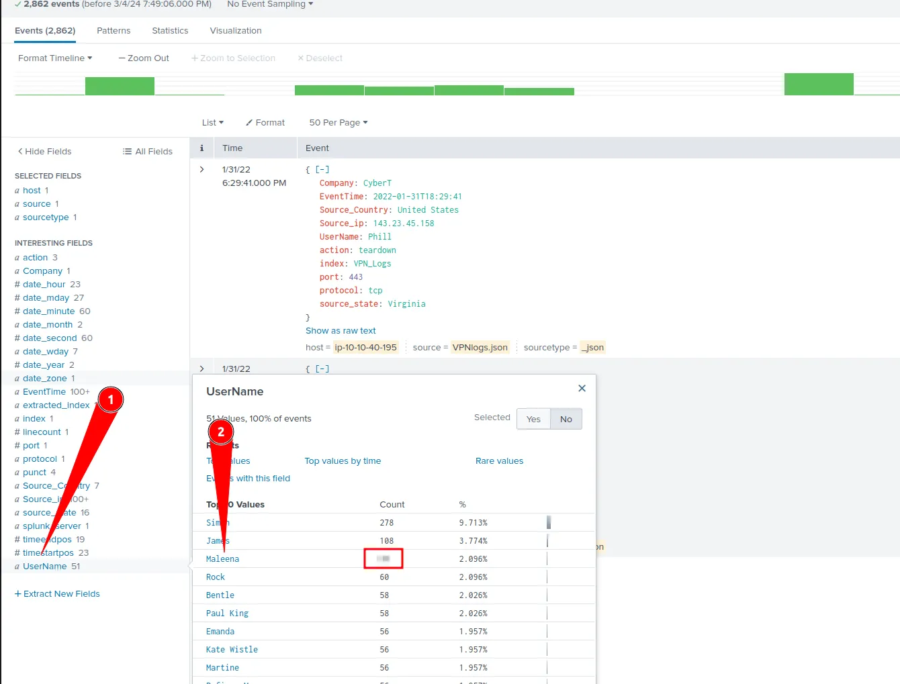
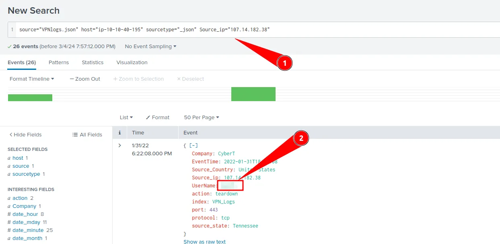
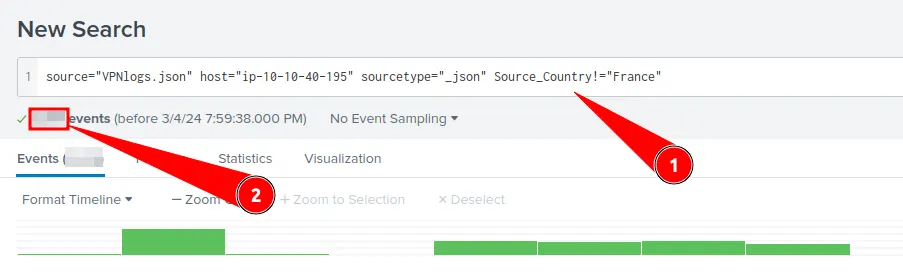
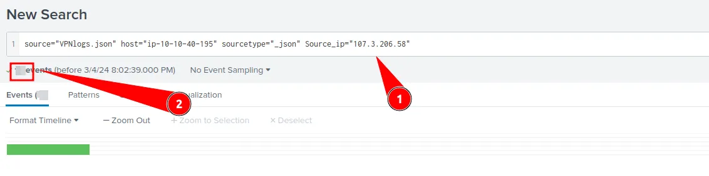

# #36: Splunk: Basics & Log Analysis

Disclosure: When I opened Splunk in my own browser it was working fine until I clicked on **Start Searching** after uploading the data in task 5.1. The VM was taking way too long to search the data and I kept getting the “Unable to connect” error in my web browser due to crashes.

Hence, I could not get my own screenshots, so rest of the screenshots I have taken from a medium blog, here’s the link to the original medium post, they deserve the credit https://medium.com/@jcm3/splunk-basics-tryhackme-walkthrough-207c679b1f62

## Scenario Overview

In this lab, I explored the fundamentals of **Splunk**, one of the most popular **SIEM (Security Information and Event Management)** tools.

I learned how Splunk’s components (Forwarder, Indexer, and Search Head) work together to collect, process, and visualize log data.

The focus was on understanding **log ingestion**, **navigation**, and **basic search operations** using **VPN logs** as data sources.

---

### **Task 1: Introduction**

- Learned the core purpose of Splunk — **real-time log collection, analysis, and correlation**.
- Key learning objectives:
    - Overview of Splunk
    - Components and data flow
    - Log ingestion methods
    - Log normalization process

---

### **Task 2: Connecting to the Lab**

- Deployed the virtual machine.
- Accessed Splunk via browser using the provided `http://10.201.110.207`.
    
    
    

---

### **Task 3: Splunk Components**

Splunk operates using **three major components**:


1. **Forwarder** – Installed on endpoints to collect and send data to Splunk.
    
    
    
2. **Indexer** – Processes and stores incoming data, converting it into searchable events.
    
    
    
3. **Search Head** – Interface for searching, reporting, and visualizing indexed data using SPL (Search Processing Language).
    
    
    

**Question:** Which component is used to collect and send data to Splunk?

**✅ Answer:** `forwarder`

---

### **Task 4: Navigating Splunk**



I explored the Splunk interface and identified its major UI sections:

1. **Splunk Bar** – Access to system settings, messages, and search features.
2. **Apps Panel** – Lists installed Splunk apps (default: *Search & Reporting*).
3. **Explore Splunk** – Quick access to add data, install apps, or view documentation.
4. **Home Dashboard** – Displays default or custom dashboards.

**Question:** In the Add Data tab, which option collects data from files and ports?




**✅ Answer:** `Monitor`

---

### **Task 5: Adding Data**

### Step 1: Upload VPN Logs

- Clicked on **Add Data → Upload.**
    
    
    
- It has a total of 5 steps to successfully upload the data.
    
    
    
    1. **Select Source** -> Where we select the Log source.
    2. **Select Source Type** > Select what type of logs are being ingested.
    3. **Input Settings** ->Select the index where these logs will be dumped and hostName to be associated with the logs.
    4. **Review** -> Review all the gif
    5. **Done** > Final step, where the data is uploaded successfully and ready to be analyzed.
- Clicked on “Select File” button and selected the `VPN Logs` file
    
    
    
    This file was provided in the lab’s page.
    
- Clicked next in all steps after this.
- After file uploaded is finished, I clicked **Start searching**.
    
    
    
- This revealed the total number of events:
    
    
    

**✅ Answer (5.1):** `2862 events`

---

### Step 2: Filter Logs by Username (Maleena)

- Opened the `UserName` field in the left panel.
- Filtered results for **Maleena**.
    
    
    

**✅ Answer (5.2):** `60 events`

---

### Step 3: Identify User by IP Address

- I filter by the IP using the following query:
    
    ```
    Source_ip="107.14.182.38"
    ```
    
    
    
- The logs showed the username associated with this IP.

**✅ Answer (5.3):** `Smith`

---

### Step 4: Exclude Logs from a Specific Country

- Used “Not Equal To” operator to filter all countries except France:
    
    ```
    Source_Country!="France"
    ```
    
    
    

**✅ Answer (5.4):** `2814 events`

---

### Step 5: Count Events for Specific IP

- Queried logs for:
    
    ```
    Source_ip="107.3.206.58"
    ```
    
    
    

**✅ Answer (5.5):** `14 events`

---

### **Task 6: Conclusion**

Through this exercise, I gained practical experience in:

- Navigating the **Splunk interface**.
- **Uploading and indexing** log data.
- Using **Splunk queries (SPL)** for filtering, searching, and analyzing events.
- Understanding the **core architecture** and **workflow** of a SIEM system.

---